# CineScope - Movie Discovery Dashboard

 CineScope is a responsive movie discovery web application that integrates with **The Movie Database (TMDB) API** to allow users to discover movies, search titles, view detailed movie information, save favourites, and submit weighted movie ratings that are synchronized with TMDB.

The project was developed in two phases:
- **Part 1** → HTML, CSS, and Vanilla JavaScript
- **Part 2** → React + Vite with Express.js and PostgreSQL backend

---
# Live Features
## Part 1
- Trending Movie Hero Banner
- Real-time Movie Search with Debounce optimization
- Genre-based Movie Filtering
- Responsive Popular Movie Card Grid
- Interactive Movie Details Modal
- Dark/Light Theme Toggle
- Skeleton Loading States
---
## Part 2 (React + Backend)
Everything from Part 1 rebuilt using React, plus:
-  Dedicated Movie Detail Pages
-  Similar Movie Recommendations
-  React Router Navigation
-  Persistent Favorites
-  Multiple-Genre Filter
-  Multi-category Movie Ratings
-  Infinite Scrolling

---
# Tech Stack
## Part 1
* **Markup:** Semantic HTML5 
* **Styling:** CSS3 
* **Scripting Engine:** Vanilla JavaScript
* **External Assets (Permitted CDNs):**
  * [Normalize.css v8.0.1](https://cdnjs.cloudflare.com/ajax/libs/normalize/8.0.1/normalize.min.css)
  * [Lucide Icons Library](https://unpkg.com/lucide@latest)
* **Data Provider:** [The Movie Database (TMDB) API](https://developer.themoviedb.org/docs)
  * Endpoints Used
    - /movie/popular
    - /trending/movie/day
    - /search/movie
    - /discover/movie
    - /genre/movie/list
    - /movie/{id}
    - /movie/{id}/credits
## Part 2
### Frontend
- React
- Vite
- React Router
- Context API
- Custom Hooks
- CSS Modules
- Fetch API

### Backend
- Node.js
- Express.js
- PostgreSQL
- pg
- dotenv
- CORS

### External APIs
- TMDB API

---
# Backend Architecture

The React application communicates with a custom Express.js backend, which manages persistent application data inside PostgreSQL.

The backend currently supports:

- User Management
- Favorites API
- Ratings API
- Weighted Rating Calculation
- TMDB Rating Synchronization

---
# Database Schema

### Users
- id
- name
- email
- created_at

### Favorites
- id
- user_id
- movie_id
- created_at

### Ratings
- id
- user_id
- movie_id
- story
- acting
- direction
- visuals
- music
- overall
- updated_at
---

# REST API Endpoints
| Method | Endpoint | Description |
|---------|----------|-------------|
| GET | /users | Fetch all users |
| POST | /users | Create user |
| GET | /favorites/:userId | Load favourites |
| POST | /favorites | Save favourite |
| DELETE | /favorites/:userId/:movieId | Remove favourite |
| GET | /ratings/:userId/:movieId | Fetch rating |
| POST | /ratings | Save weighted rating |

---

# Screenshots
## Part 1 (Vanilla JavaScript)
### Desktop View


### Mobile View


## Part 2 (React + Backend)
### Desktop View
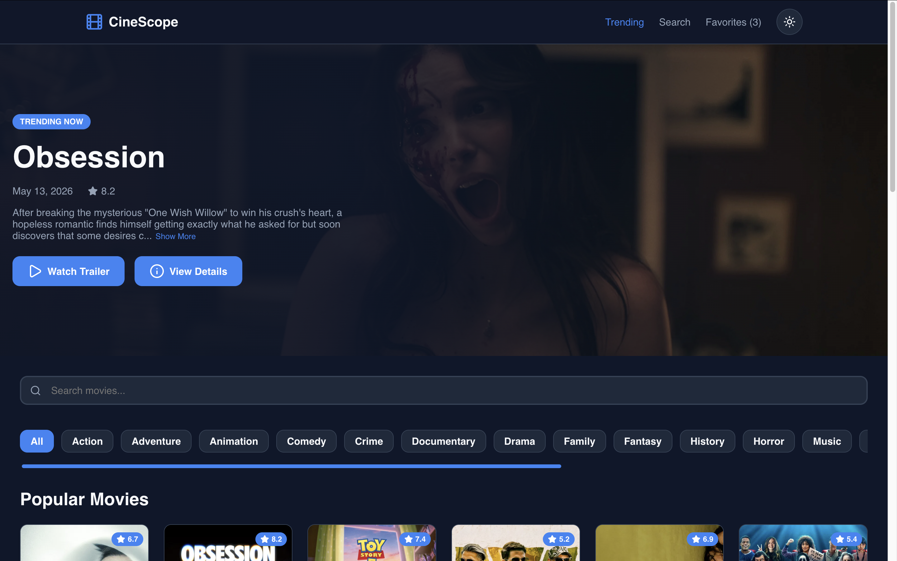
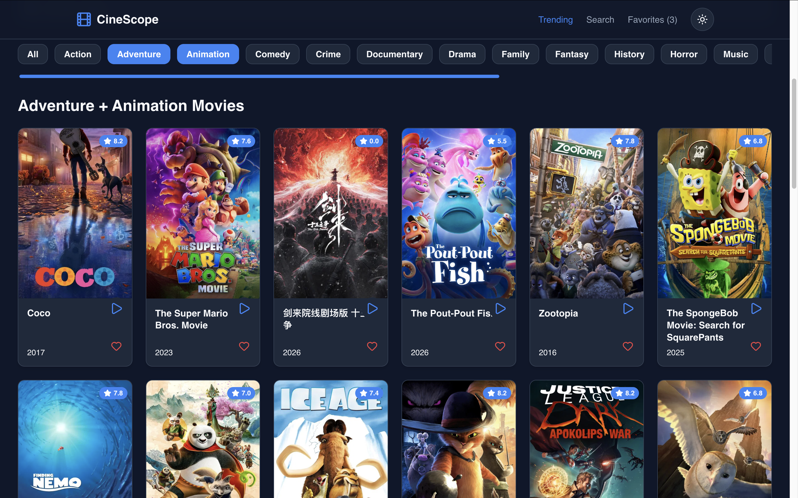
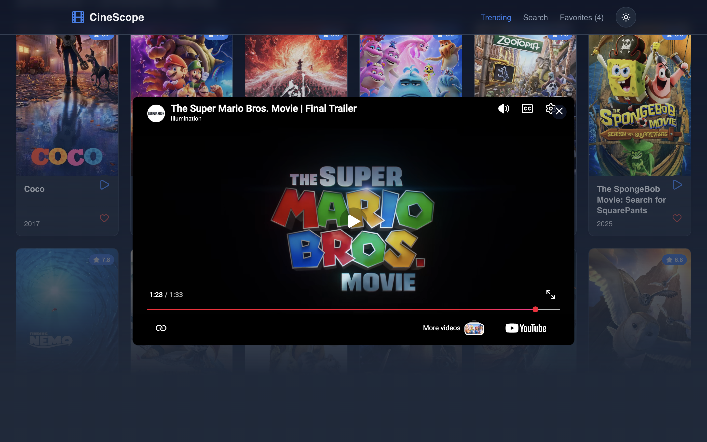
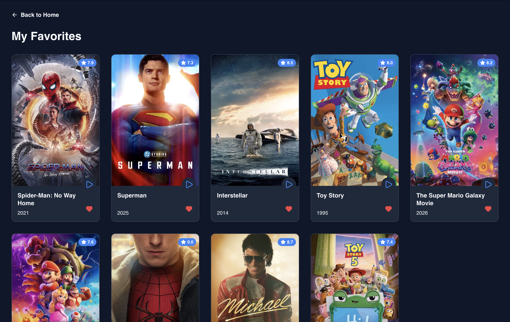
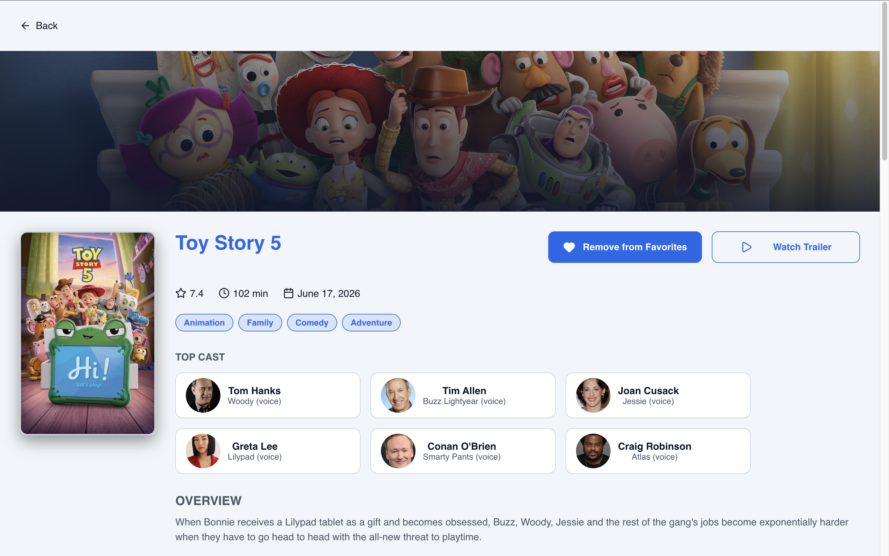
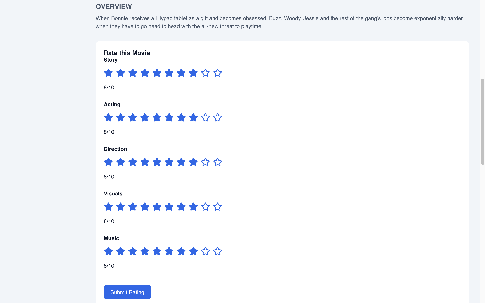
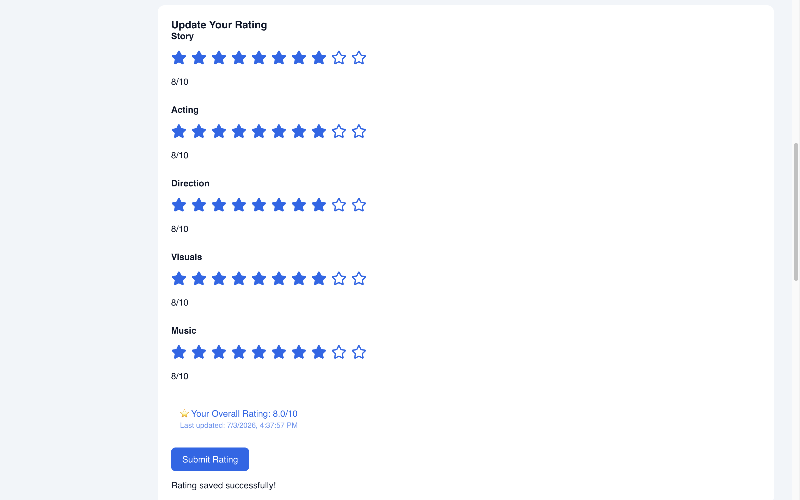
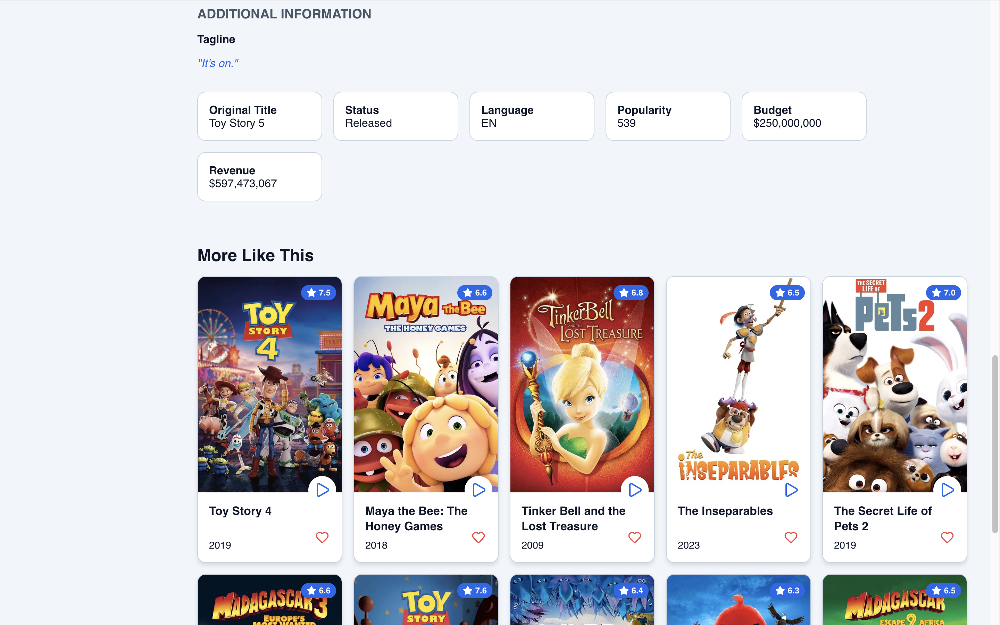

### Mobile View
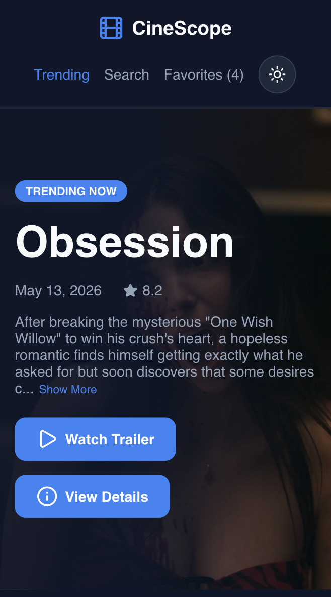
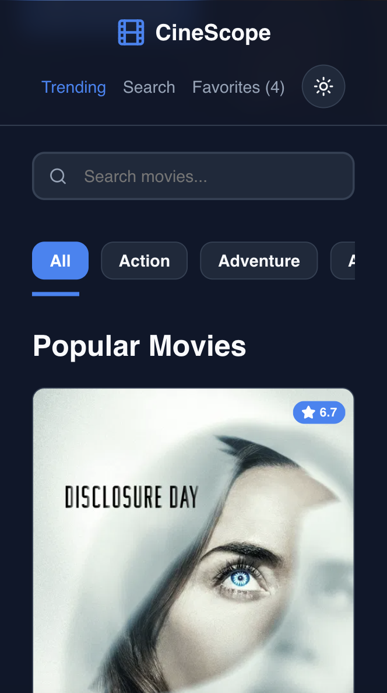
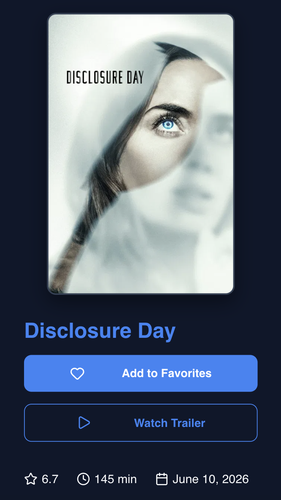
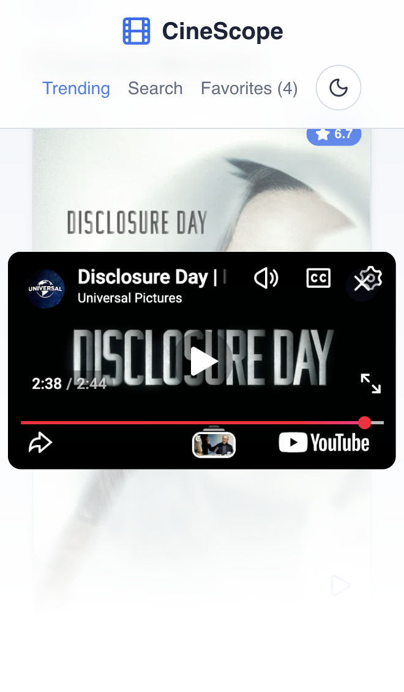

---
# Local Setup & Installation Instructions
## Part-1
1. **Clone the Public Repository:**
   ```bash
   git clone [https://github.com/Srisha-007/internship-srisha-das.git]
   cd internship-srisha-das/part-1
2. **Acquire a Developer API Access Key**
   - Visit TMDB Profile Portal and create a free account.
   - Navigate to settings, request an API Key, and copy your unique token.
3. **Establish Local Environmental Context**
   - At the absolute root directory of your /part-1 folder, create a private configuration file named exactly config.js.
   - Open config.js and input your developer key parameter (please refer to the config.example.js file) 
4. **Verify Local Git Ignore Filter**
   - Ensure your local system ignores this key file by reviewing your .gitignore configuration before attempting to push code online.
     ```plaintext
     # .gitignore
      part-1/config.js
      node_modules/
     ```
5. **Launch the Engine**
   - Open index.html via a serving pipeline (e.g., VS Code Live Server utility extension) to run the application in your local browser window.

---
## Part 2 (React + Express + PostgreSQL)
1. **Navigate to Part 2**
```bash
cd ../part-2
```
2. **Install Dependencies**
 - Frontend
```bash
npm install
```
 - Backend
```bash
cd backend
npm install
cd ..
```
3. **Configure Environment Variables**
 - Frontend (.env)
Create a `.env` file inside `part-2/`.

```env
VITE_TMDB_API_KEY=your_tmdb_api_key
```

 - Backend (.env)
Create another `.env` file inside `part-2/backend/`.

```env
PORT=8000

DB_HOST=localhost
DB_PORT=5432
DB_NAME=cinescope
DB_USER=postgres
DB_PASSWORD=your_postgres_password

TMDB_API_KEY=your_tmdb_api_key
TMDB_GUEST_SESSION=your_tmdb_guest_session_id
```

> Both `.env` files are ignored by Git and should **not** be committed.

4. **Create the PostgreSQL Database**
Create a database named:

```text
cinescope
```

Then execute the schema:

```bash
psql -U postgres -d cinescope
```

Inside PostgreSQL:

```sql
\i backend/src/database/schema.sql
```

This creates the following tables:

- users
- favorites
- ratings

5. **Create an Initial User**

Insert a sample user:
```sql
INSERT INTO users(name,email)
VALUES
('Alex','alex@test.com');
```

6. **Start the Backend Server**
```bash
cd backend
npm run dev
```
Backend runs on:
```
http://localhost:8000
```
7. **Start the React Frontend**

Open another terminal.

```bash
cd part-2
npm run dev
```

Open:

```
http://localhost:5173
```
---
# What I Struggled With & How I Solved Them (Part-1)
1. **High-Contrast Text Legibility Over Unknown API Backdrops**
   - The Problem: The movie hero background relies on a dynamic URL fetched from the external API. When a bright, high-key movie backdrop loaded, it completely washed out the white typography layout, and thereby violating key web accessibility standards.
     
   - Solution: I applied a modern stacked layering system inside the element's CSS rules.
     I paired a dark background color fallback with a progressive linear-gradient color mask:
     ```plaintext
     linear-gradient(to right, rgba(15, 23, 42, 0.95) 40%, rgba(15, 23, 42, 0.6))
     ```
     This ensures that movie details are readable regardless of how bright the underlying movie image is.
     
2. **Managing asynchronous data injection with 3rd-Party UI Asset Builders**
   - The Problem: After integrating the live API data stream, my Lucide icons (like the movie rating star icon) completely vanished from the newly rendered movie cards. They were properly being displayed when the HTML was hardcoded, but once the cards were generated dynamically through JavaScript, the icons remained as empty text elements.

   - Solution: I went through the Lucide lifecycle documentation and learned that the library scans the DOM once when the initial page loads. Because my API fetch call happens asynchronously, the data-driven cards are injected into the grid after that initial scan has already completed. I solved this by explicitly calling
     ```plaintext
     lucide.createIcons();
     ```
     at the very end of my renderMovieGrid() function, forcing the library to re-parse the newly injected DOM elements.
     
3. **Optimizing Network Overhead via In-Memory Request Caching for Genre Filters**
   - The Problem: When interacting with the user interface, repeatedly toggling between the same genre filter pills (e.g., switching between "Action" and "Sci-Fi" multiple times) forced the application to fire redundant, duplicate HTTP requests to the TMDB server. This resulted in unnecessary network usage and an inefficient abuse of the remote API rate limits.

   - Solution: I implemented a in-memory caching mechanism for genre responses using a JavaScript object (const genreCache = {};). Before executing an asynchronous fetch payload, the retrieval function checks if the requested genre ID already exists as a key within the cache object. If a match is found, the application instantly feeds the UI with the cached data, without additional API requests. If it is a new genre, the application fetches the data from the server, saves a copy into the cache hash map, and then renders the grid.
   This improved responsiveness and also reduced API overhead.
---
# What I Learned (Part-1)
- Working with asynchronous API calls using fetch and async/await
- working with REST APIs
- Managing UI state manually in vanilla JavaScript
- Implementing debounced search for performance optimization
- Building responsive layouts using Flexbox and CSS Grid
- Using CSS custom properties for scalable theming
- Handling API errors and loading states </br>
I also learned how important perceived performance is in frontend applications through loading states, skeleton screens, and request management.
---
# Performance Improvements
- Added debounced search to reduce unnecessary API calls
- Used AbortController to cancel outdated search requests
- Implemented genre caching to avoid repeated API fetches
- Added skeleton loaders for improved perceived performance
---
# React vs. Vanilla JavaScript
## What became easier in React
Rebuilding CineScope in React helped me understand why component-based development is preferred for larger applications.

### Component Reusability
React encouraged me to write reusable code. For example, the same MovieCard component is used on the homepage, favorites page, and recommendations section without duplicating code.

### State Management
In Vanilla JavaScript, whenever data changes, I would have to manually find DOM elements and update them. In React, changing state automatically re-renders only the affected components, which simplifies UI updates significantly.

### Routing
React Router made navigation between pages much simpler compared to manually managing URLs and page changes in Vanilla JavaScript. Now, every movie has its own dedicated URL, thus users can now bookmark pages, navigate using browser history, and directly access movie details.

### Better Project Organization
Separating the application into components, hooks, contexts, services, pages, and backend modules made the project much easier to maintain and extend compared to keeping most logic inside a few JavaScript files.

---

## What was harder in React

- Learning how React re-renders components and why state should never be mutated directly required a different way of thinking compared to Vanilla JavaScript.
- Understanding dependency arrays, asynchronous effects, and avoiding unnecessary re-renders was one of the biggest learning curves
- Integrating the React frontend with an Express.js backend and PostgreSQL database introduced additional complexity, particularly around keeping frontend state, backend APIs, and database records synchronized.
- Moving favourites and ratings away from localStorage into shared React contexts while communicating with backend APIs required careful state management.

React also required more planning. As the application grew, I had to think about how to split functionality into components, hooks, contexts, and service files instead of writing everything in one place.

---
# Future Improvements
Given more development time, I would further enhance CineScope by adding:
- User authentication using JWT
- User-written movie reviews
- Rating analytics dashboard
- Advanced filters (language, year, rating)
- Sorting options
- Deployment using Vercel and Render
---
# Reflection
## Part-1  
- This project helped me move beyond static frontend development and think more about user experience, responsiveness, and frontend architecture.
The biggest shift for me was learning how frontend development is not just about making interfaces look good, since it also involves thinking about performance optimization, accessibility, asynchronous data handling, and responsive behavior across devices. </br>
One of the most rewarding parts was seeing how relatively small improvements like debouncing, caching, and skeleton loaders significantly improved the overall user experience.

## Part-2  
- Although React introduced a steeper learning curve, it significantly reduced manual DOM manipulation and encouraged a cleaner architecture. </br>
By the end of the project, I understood that React is not simply about writing fewer lines of code, it is about organizing applications into reusable, maintainable components that scale much better as projects grow.
---