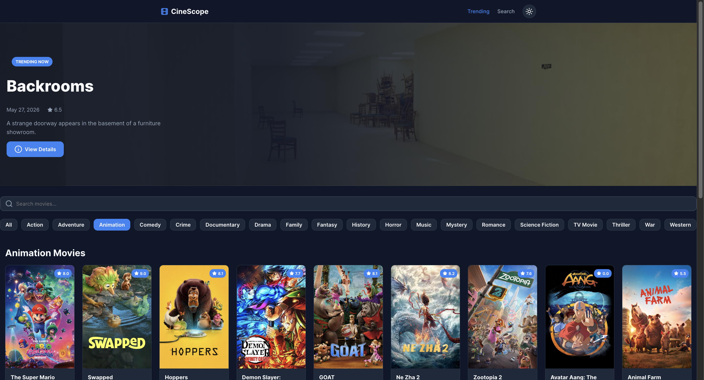
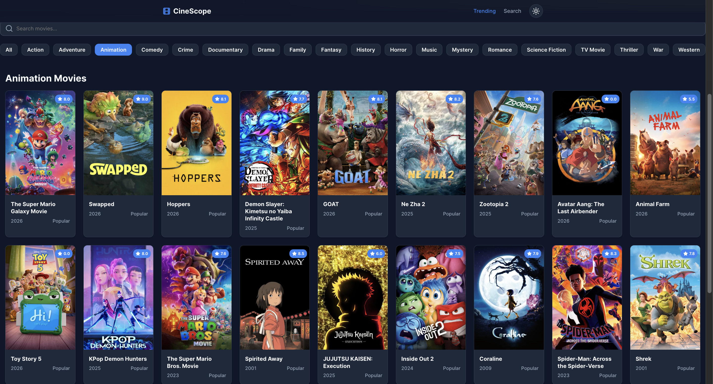
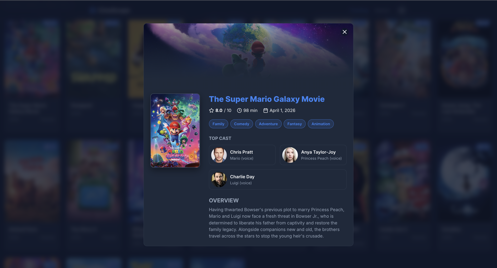
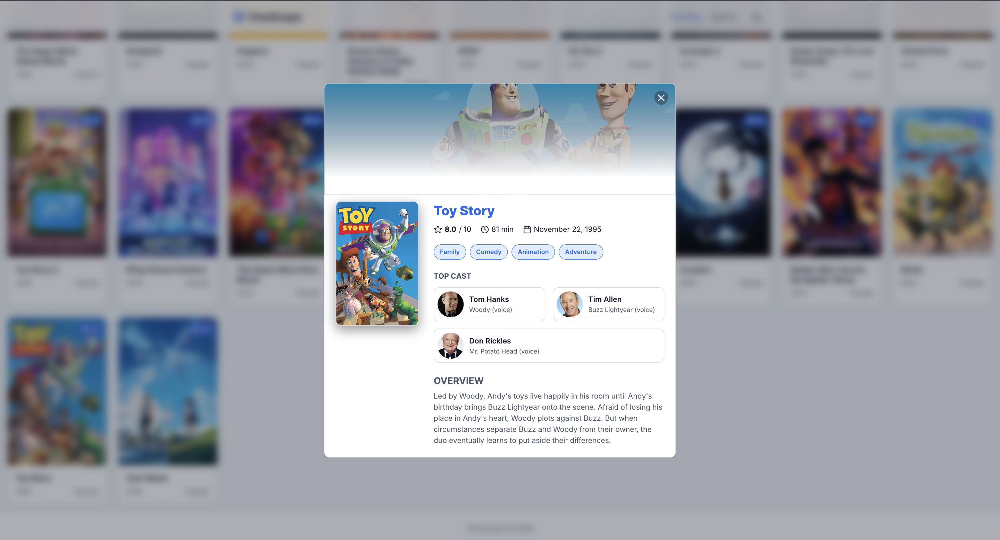
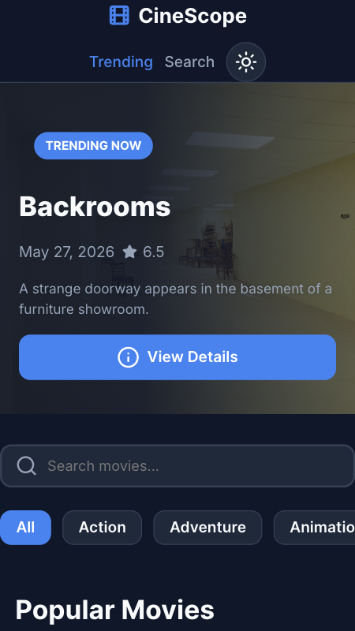
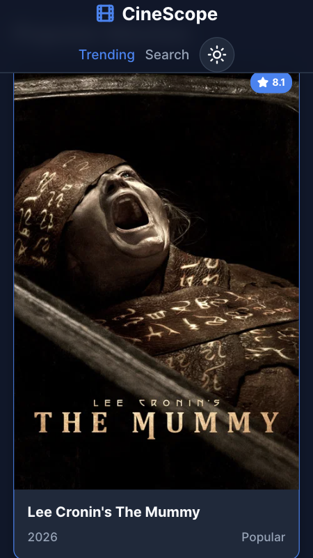
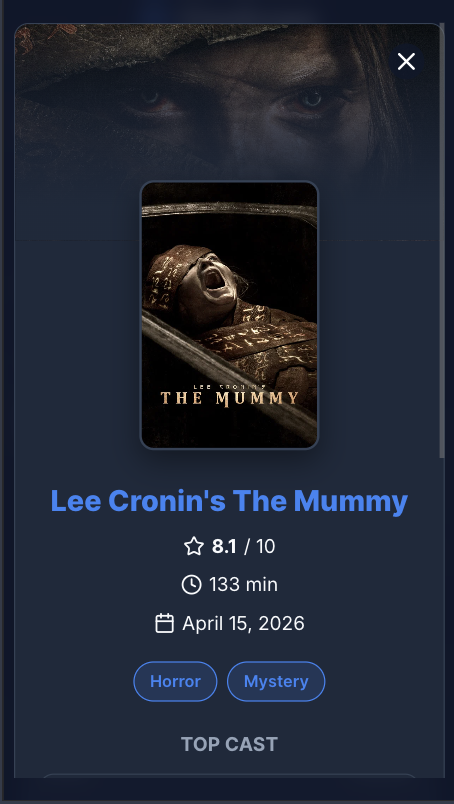
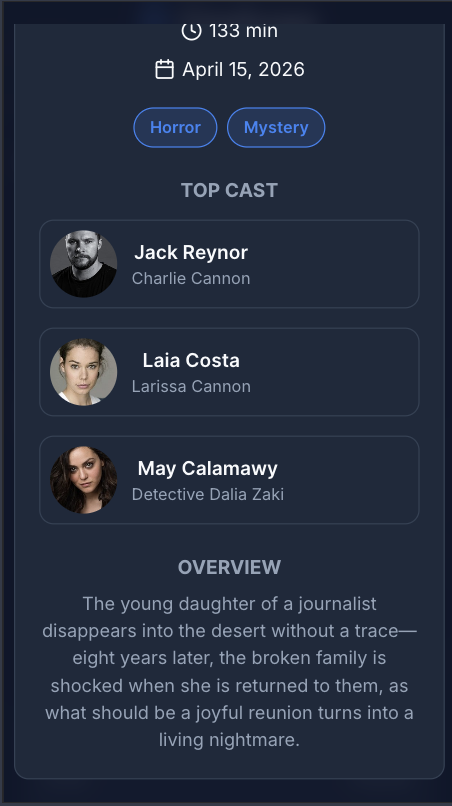
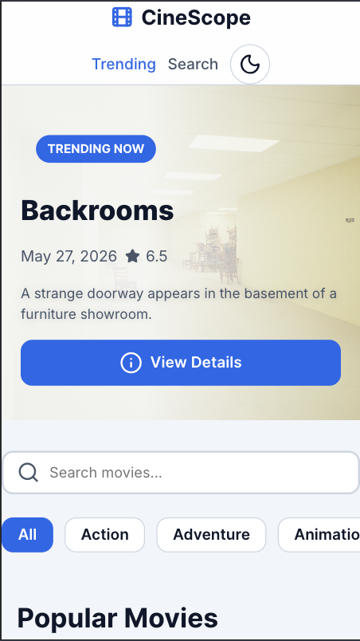

# CineScope - Movie Discovery Dashboard

A responsive movie discovery dashboard built using HTML, CSS, and Vanilla JavaScript, powered by the TMDB API. CineScope allows users to browse trending movies, search titles in real time, filter movies by genre, and explore detailed movie information through an interactive modal interface.

The project is being developed in two phases:
- Part 1 → Vanilla HTML, CSS, and JavaScript
- Part 2 → React + Vite implementation

---
# Live Features
- Trending movie hero banner
- Real-time movie search with debounce optimization
- Genre-based movie filtering
- Responsive popular movie card grid
- Interactive movie detail modal
- Dark/light theme toggle
---
# Tech Stack
## Part 1
* **Markup:** Semantic HTML5 
* **Styling:** CSS3 
* **Scripting Engine:** Vanilla JavaScript
* **External Assets (Permitted CDNs):**
  * [Normalize.css v8.0.1](https://cdnjs.cloudflare.com/ajax/libs/normalize/8.0.1/normalize.min.css)
  * [Lucide Icons Library](https://unpkg.com/lucide@latest)
* **Data Provider:** [The Movie Database (TMDB) API](https://developer.themoviedb.org/docs)
  * Endpoints Used
    - /movie/popular
    - /trending/movie/day
    - /search/movie
    - /discover/movie
    - /genre/movie/list
    - /movie/{id}
    - /movie/{id}/credits
## Part 2
- React
- Vite
- React Router
- CSS Modules
- TMDB API
---
# Screenshots
## Desktop View





## Mobile View






---
# Local Setup & Installation Instructions
1. **Clone the Public Repository:**
   ```bash
   git clone [https://github.com/Srisha-007/internship-srisha-das.git]
   cd internship-your-srisha-das/part-1
2. **Acquire a Developer API Access Key**
   - Visit TMDB Profile Portal and create a free account.
   - Navigate to settings, request an API Key, and copy your unique token.
3. **Establish Local Environmental Context**
   - At the absolute root directory of your /part-1 folder, create a private configuration file named exactly config.js.
   - Open config.js and input your developer key parameter (please refer to the config.example.js file) 
4. **Verify Local Git Ignore Filter**
   - Ensure your local system ignores this key file by reviewing your .gitignore configuration before attempting to push code online.
     ```plaintext
     # .gitignore
      part-1/config.js
      node_modules/
     ```
5. **Launch the Engine**
   - Open index.html via a serving pipeline (e.g., VS Code Live Server utility extension) to run the application in your local browser window.
---
# What I Struggled With & How I Solved Them
1. **High-Contrast Text Legibility Over Unknown API Backdrops**
   - The Problem: The movie hero background relies on a dynamic URL fetched from the external API. When a bright, high-key movie backdrop loaded, it completely washed out the white typography layout, and thereby violating key web accessibility standards.
     
   - Solution: I applied a modern stacked layering system inside the element's CSS rules.
     I paired a dark background color fallback with a progressive linear-gradient color mask:
     ```plaintext
     linear-gradient(to right, rgba(15, 23, 42, 0.95) 40%, rgba(15, 23, 42, 0.6))
     ```
     This ensures that movie details are readable regardless of how bright the underlying movie image is.
     
2. **Managing asynchronous data injection with 3rd-Party UI Asset Builders**
   - The Problem: After integrating the live API data stream, my Lucide icons (like the movie rating star icon) completely vanished from the newly rendered movie cards. They were properly being displayed when the HTML was hardcoded, but once the cards were generated dynamically through JavaScript, the icons remained as empty text elements.

   - Solution: I went through the Lucide lifecycle documentation and learned that the library scans the DOM once when the initial page loads. Because my API fetch call happens asynchronously, the data-driven cards are injected into the grid after that initial scan has already completed. I solved this by explicitly calling
     ```plaintext
     lucide.createIcons();
     ```
     at the very end of my renderMovieGrid() function, forcing the library to re-parse the newly injected DOM elements.
     
3. **Optimizing Network Overhead via In-Memory Request Caching for Genre Filters**
   - The Problem: When interacting with the user interface, repeatedly toggling between the same genre filter pills (e.g., switching between "Action" and "Sci-Fi" multiple times) forced the application to fire redundant, duplicate HTTP requests to the TMDB server. This resulted in unnecessary network usage and an inefficient abuse of the remote API rate limits.

   - Solution: I implemented a in-memory caching mechanism for genre responses using a JavaScript object (const genreCache = {};). Before executing an asynchronous fetch payload, the retrieval function checks if the requested genre ID already exists as a key within the cache object. If a match is found, the application instantly feeds the UI with the cached data, without additional API requests. If it is a new genre, the application fetches the data from the server, saves a copy into the cache hash map, and then renders the grid.
   This improved responsiveness and also reduced API overhead.
---
# What I Learned
- Working with asynchronous API calls using fetch and async/await
- working with REST APIs
- Managing UI state manually in vanilla JavaScript
- Implementing debounced search for performance optimization
- Building responsive layouts using Flexbox and CSS Grid
- Using CSS custom properties for scalable theming
- Handling API errors and loading states </br>
I also learned how important perceived performance is in frontend applications through loading states, skeleton screens, and request management.
---
# Performance Improvements
- Added debounced search to reduce unnecessary API calls
- Used AbortController to cancel outdated search requests
- Implemented genre caching to avoid repeated API fetches
- Added skeleton loaders for improved perceived performance
---
# What I Would Add Next
Given more development time, I would expand CineScope with some features:
- Add movie trailers using the TMDB videos endpoint   
- Add advanced filtering (rating, year, language)
- Add "Similar" movie recommendations
- Add pagination for movie results
---
# Reflection  
- This project helped me move beyond static frontend development and think more about user experience, responsiveness, and frontend architecture.
The biggest shift for me was learning how frontend development is not just about making interfaces look good, since it also involves thinking about performance optimization, accessibility, asynchronous data handling, and responsive behavior across devices. </br>
One of the most rewarding parts was seeing how relatively small improvements like debouncing, caching, and skeleton loaders significantly improved the overall user experience.
---